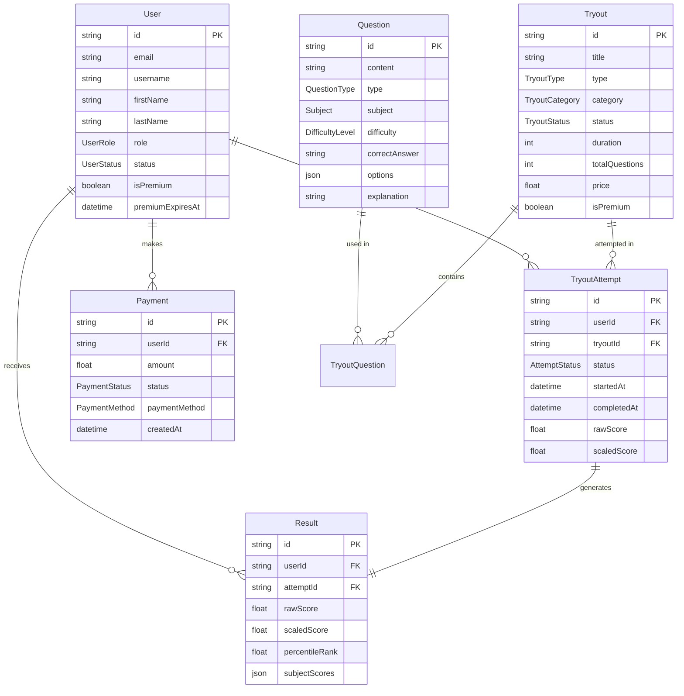

# 🗄️ Database Schema Documentation - Tryout Platform

## 📋 Overview

Schema database yang kompleks dan lengkap untuk platform tryout online seperti SainsIn, dengan support untuk multiple user roles, sistem pembayaran, analytics, dan content management.

## 🏗️ Database Architecture

### Core Features:
- ✅ **Multi-role User Management** (Super Admin, Admin, Writer, User, Premium User)
- ✅ **Comprehensive Tryout System** (Free & Premium)
- ✅ **Advanced Question Management** with IRT scoring
- ✅ **Payment & Subscription System**
- ✅ **Analytics & Progress Tracking**
- ✅ **Content Management System**
- ✅ **Notification System**
- ✅ **Audit & Reporting**

## 📊 Entity Relationship Diagram



## 🎭 User Roles & Permissions

### 1. **SUPER_ADMIN** 
- Full system access
- User management (create, edit, delete all users)
- System configuration
- Payment management
- Full analytics access
- Audit log access

### 2. **ADMIN**
- Tryout management
- Question review and approval
- User support
- Analytics (limited)
- Content moderation

### 3. **WRITER**
- Create and edit questions
- Create tryouts
- View own content analytics
- Limited user interaction

### 4. **USER** (Free)
- Take free tryouts
- View basic results
- Limited analytics
- Basic profile management

### 5. **PREMIUM_USER**
- All USER permissions
- Take premium tryouts
- Detailed analytics and insights
- Advanced study planning
- Priority support

## 📝 Core Models Explanation

### User Management

#### **User Model**
```typescript
- id: string (Primary Key)
- email: string (Unique)
- username: string (Unique, Optional)
- firstName: string
- lastName: string  
- password: string (Hashed)
- role: UserRole (Enum)
- status: UserStatus (Enum)
- isPremium: boolean
- premiumExpiresAt: DateTime
- school: string (Optional)
- targetUniversity: string (Optional)
- targetMajor: string (Optional)
```

**Key Features:**
- Email verification system
- Password reset functionality
- Two-factor authentication support
- Session management
- Analytics tracking

### Tryout System

#### **Tryout Model**
```typescript
- id: string (Primary Key)
- title: string
- type: TryoutType (FREE | PREMIUM | SPECIAL)
- category: TryoutCategory (UTBK_SNBT | TKA_SAINTEK | etc.)
- status: TryoutStatus (DRAFT | PUBLISHED | ARCHIVED)
- duration: int (minutes)
- totalQuestions: int
- price: float (0 for free)
- maxAttempts: int (1 for free, 3 for premium)
```

#### **Question Model**
```typescript
- id: string (Primary Key)
- content: string (HTML/Markdown supported)
- type: QuestionType (MULTIPLE_CHOICE | FILL_IN_BLANK | etc.)
- subject: Subject (MATEMATIKA | FISIKA | etc.)
- difficulty: DifficultyLevel (VERY_EASY to VERY_HARD)
- options: JSON (for multiple choice)
- correctAnswer: string
- explanation: string
- difficultyScore: float (IRT parameter)
- discrimination: float (IRT parameter)
```

**Advanced Features:**
- IRT (Item Response Theory) scoring system
- Multi-media support (images, videos, audio)
- Question tagging and categorization
- Usage statistics and analytics
- Bookmarking system

### Results & Analytics

#### **TryoutAttempt Model**
```typescript
- id: string (Primary Key)
- userId: string (Foreign Key)
- tryoutId: string (Foreign Key)
- status: AttemptStatus
- startedAt: DateTime
- completedAt: DateTime
- timeSpent: int (seconds)
- currentQuestionIndex: int (for resume)
- sessionData: JSON (current state)
```

#### **Result Model**
```typescript
- id: string (Primary Key)
- rawScore: float
- scaledScore: float (IRT-based)
- percentileRank: float
- subjectScores: JSON (breakdown by subject)
- strengths: JSON (strong areas)
- weaknesses: JSON (improvement areas)
- universityPredictions: JSON (acceptance chances)
```

### Payment System

#### **Payment Model**
```typescript
- id: string (Primary Key)
- userId: string (Foreign Key)
- amount: float
- currency: string (default: "IDR")
- status: PaymentStatus (PENDING | COMPLETED | FAILED)
- paymentMethod: PaymentMethod (CREDIT_CARD | E_WALLET | etc.)
- externalId: string (Payment gateway ID)
```

#### **Subscription Model**
```typescript
- id: string (Primary Key)
- userId: string (Foreign Key)  
- planName: string
- status: SubscriptionStatus
- startDate: DateTime
- endDate: DateTime
- tryoutQuota: int (number of premium tryouts)
- features: JSON (enabled features)
```

## 🔍 Advanced Features

### 1. **IRT Scoring System**
- Difficulty parameter per question
- Discrimination parameter
- Guessing parameter  
- Scaled scoring like real UTBK

### 2. **Analytics & Progress Tracking**
- Individual user analytics
- Tryout performance metrics
- Subject-wise progress
- Study time tracking
- Streak tracking

### 3. **Study Management**
- Personal study plans
- Study activities tracking
- Progress monitoring
- Subject recommendations

### 4. **Content Management**
- Article/blog system
- Multi-media content support
- Version control for questions
- Content review workflow

### 5. **Notification System**
- Email templates
- Push notifications
- System announcements
- Result notifications

### 6. **Audit & Security**
- Complete audit log
- User session tracking
- IP address logging
- Security event monitoring

## 🎯 Key Relationships

### User → Tryout Attempts (1:N)
- Users can take multiple tryouts
- Each attempt is tracked separately
- Support for multiple attempts per tryout

### Question → Tryout (N:M)
- Questions can be reused across tryouts
- Flexible question assignment
- Section-based organization

### Payment → Subscription (1:N)
- Single payment can activate multiple subscriptions
- Support for various payment methods
- Refund tracking

### User → Analytics (1:1)
- Comprehensive user performance tracking
- Real-time analytics updates
- Historical data preservation

## 📈 Scalability Considerations

### Database Optimizations:
- Proper indexing on frequently queried fields
- JSON fields for flexible data storage
- Soft deletes for data integrity
- Audit trails for compliance

### Performance Features:
- Redis caching for frequently accessed data
- Background job processing for heavy analytics
- CDN integration for media content
- Database sharding strategies

## 🔒 Security Features

### Authentication & Authorization:
- JWT-based authentication
- Role-based access control (RBAC)
- Session management
- Two-factor authentication support

### Data Protection:
- Password hashing with bcrypt
- Email verification
- Rate limiting
- SQL injection prevention
- XSS protection

## 🚀 Installation & Setup

### 1. Environment Setup
```bash
# Copy environment file
cp .env.example .env

# Edit database URL and other configurations
nano .env
```

### 2. Database Setup
```bash
# Install dependencies
npm install

# Generate Prisma client
npx prisma generate

# Run migrations
npm run db:migrate

# Seed database with sample data
npm run db:seed
```

### 3. Development
```bash
# Start development server
npm run dev

# Open Prisma Studio (Database GUI)
npm run db:studio
```

## 📋 Sample Login Credentials

After running the seed script:

- **Super Admin**: admin@tryoutplatform.com / admin123
- **Writer**: writer@tryoutplatform.com / writer123  
- **Demo User**: user@tryoutplatform.com / user123
- **Premium User**: premium@tryoutplatform.com / user123

## 🎉 Next Steps

1. **API Development**: Create REST/GraphQL APIs
2. **Frontend Development**: Build React/Next.js components
3. **Authentication**: Implement NextAuth.js
4. **Payment Integration**: Add Midtrans/Stripe
5. **Deployment**: Setup production environment

## 🤝 Contributing

This schema is designed to be flexible and extensible. You can:
- Add new question types
- Extend user roles  
- Add more payment methods
- Implement additional analytics
- Customize for different exam types

---

**📞 Support**: Jika ada pertanyaan tentang schema ini, silakan hubungi tim development.