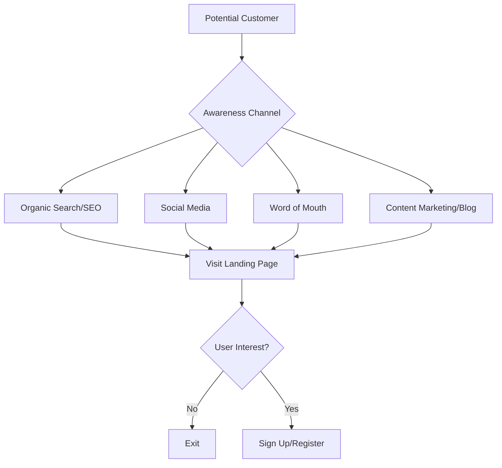
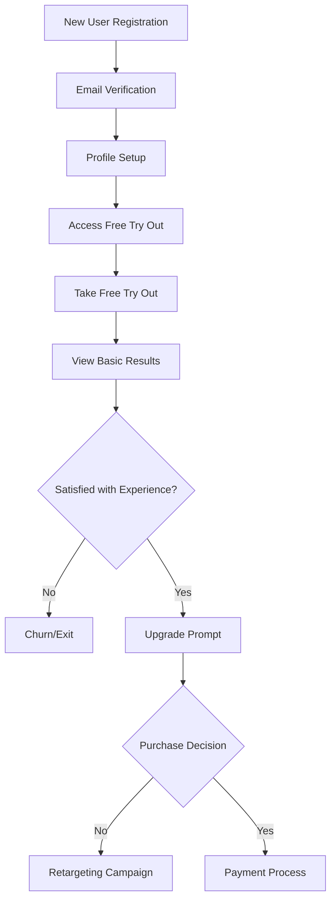
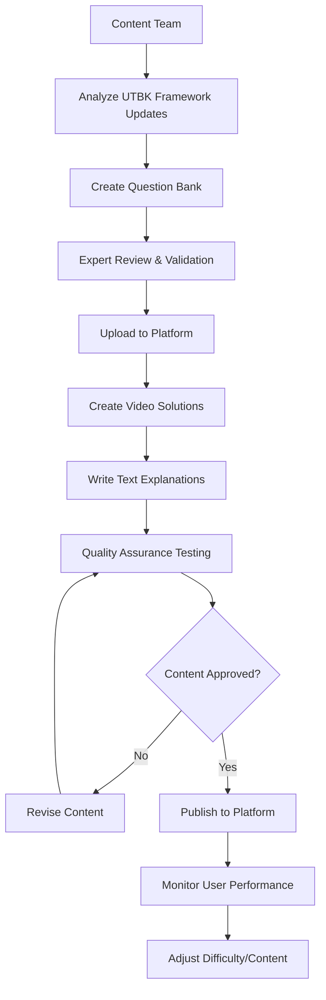
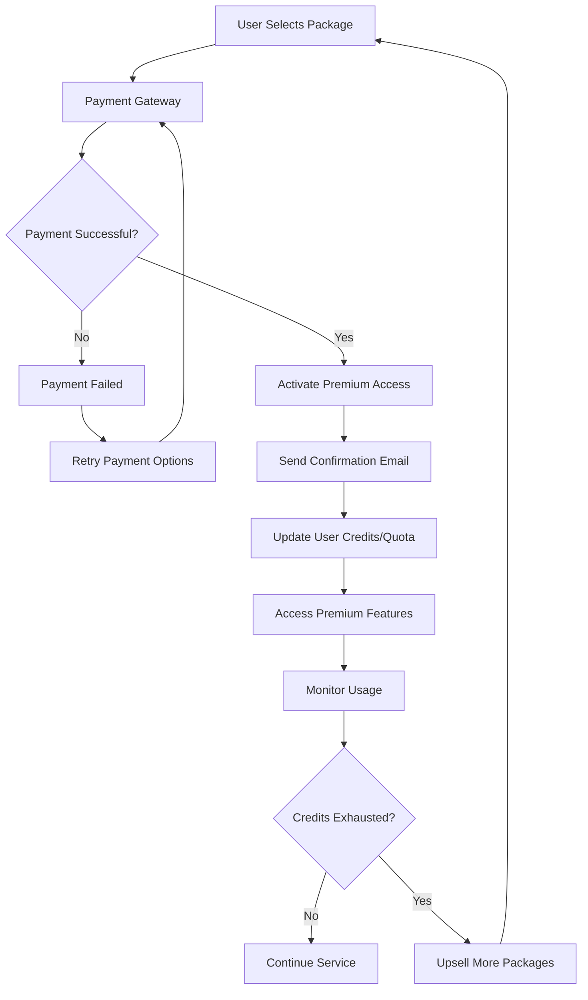
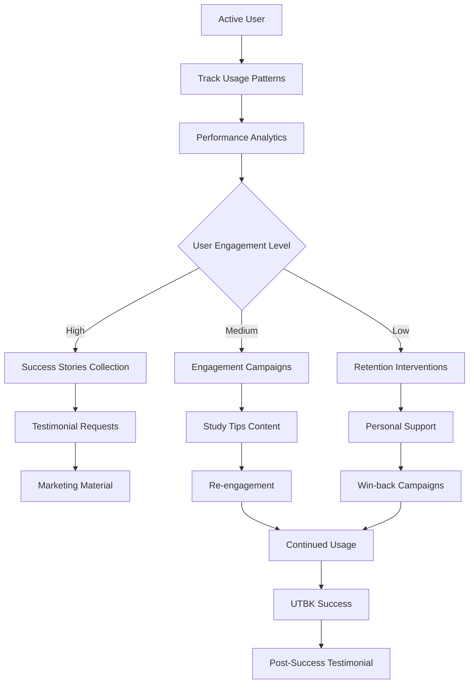
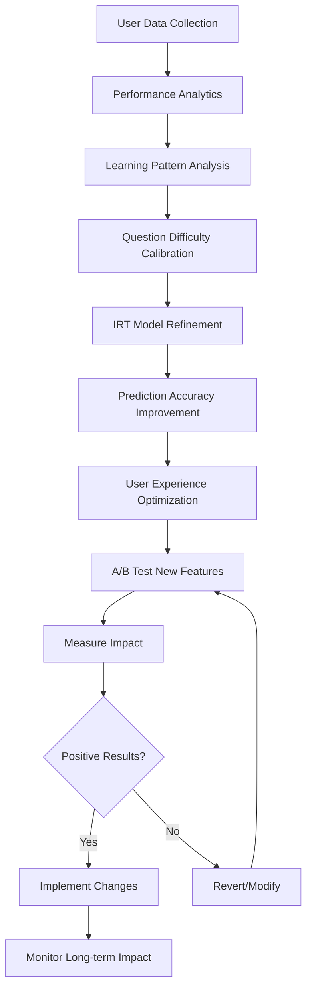

# Evaluasi Website SainsIn.com dan Business Process Flow

## 📊 Evaluasi Website SainsIn.com

### 1. **Profil Bisnis**
- **Nama**: SainsIn (PT Sains Adalah Kunci)
- **Lokasi**: Badung, Bali
- **Industri**: EdTech - Persiapan UTBK SNBT (Seleksi Nasional Berbasis Tes)
- **Target Market**: Siswa SMA yang akan mengikuti UTBK untuk masuk PTN

### 2. **Nilai Proposisi Utama**
- Try Out UTBK yang mirip dengan tes asli
- Sistem penilaian IRT (Item Response Theory) sesuai standar UTBK
- Pembahasan lengkap dengan video dan teks
- Fitur rasionalisasi jurusan berdasarkan hasil
- Analisis peluang kelulusan per jurusan PTN

### 3. **Model Bisnis**
- **Revenue Stream**: Penjualan paket try out premium
- **Freemium Model**: Try out gratis dengan fitur terbatas + premium paid
- **Pricing Strategy**: Mulai dari Rp 6.600 per try out hingga Rp 129.000 untuk 15 kuota

### 4. **Fitur Unggulan**
- ✅ Soal sesuai framework terbaru BP3 untuk SNBT
- ✅ Penilaian menggunakan sistem IRT seperti UTBK asli
- ✅ Pembahasan video dan teks yang komprehensif
- ✅ Rasionalisasi jurusan dan prediksi peluang kelulusan
- ✅ Ranking peserta dan perbandingan dengan target jurusan
- ✅ Try out dapat dikerjakan ulang hingga 3 kali
- ✅ Akses multi-platform (web, mobile)

### 5. **Kekuatan Kompetitif**
- **Social Proof Kuat**: Testimoni nyata dengan nilai TO vs UTBK
- **Kredibilitas**: Peserta Google for Indonesia 2020
- **Akurasi Tingkat Tinggi**: Nilai try out mendekati nilai UTBK sebenarnya
- **Community Building**: Study group Telegram

### 6. **Analisis SWOT**

#### Strengths:
- Teknologi penilaian IRT yang akurat
- Track record testimoni yang verifiable
- Pembahasan lengkap dengan multimedia
- Harga terjangkau dan fleksibel

#### Weaknesses:
- Brand awareness masih terbatas dibanding kompetitor besar
- Fokus hanya pada UTBK (tidak diversifikasi ke tes lain)

#### Opportunities:
- Market siswa SMA Indonesia yang besar (~4 juta siswa/tahun)
- Tren digitalisasi pendidikan yang meningkat
- Ekspansi ke tes masuk universitas lain (SIMAK UI, UM UGM, dll)

#### Threats:
- Kompetitor besar dengan budget marketing lebih besar
- Perubahan sistem seleksi PTN oleh pemerintah
- Platform gratisan yang didukung pemerintah

---

## 🔄 Business Process Flow SainsIn

### **1. Customer Acquisition Process**



### **2. User Onboarding & Free Trial Process**



### **3. Core Service Delivery Process**

```mermaid
graph TD
    A[Premium User] --> B[Access Premium Try Out]
    B --> C[Select Try Out Session]
    C --> D[Computer-Based Test Interface]
    
    D --> E[Answer Questions]
    E --> F[Submit Test]
    F --> G[IRT Scoring Algorithm]
    
    G --> H[Generate Detailed Results]
    H --> I[Show Score & Ranking]
    I --> J[University Recommendation]
    J --> K[Detailed Analysis Report]
    
    K --> L[Access Video Solutions]
    L --> M[Text-based Explanations]
    M --> N{Retake Test?}
    
    N -->|Yes| O[Retake Test (Max 3x)]
    N -->|No| P[Study More Content]
    
    O --> G
    P --> Q[Prepare for Next Test]
```

### **4. Content Management Process**



### **5. Payment & Subscription Management**



### **6. Customer Success & Retention Process**



### **7. Data Analytics & Optimization Process**



---

## 📈 Key Performance Indicators (KPIs)

### Business Metrics:
- **Conversion Rate**: Free to Premium conversion
- **Customer Acquisition Cost (CAC)**
- **Customer Lifetime Value (CLV)**
- **Monthly Recurring Revenue (MRR)**
- **Churn Rate**: Premium user retention

### Product Metrics:
- **Test Completion Rate**
- **Score Prediction Accuracy**: TO score vs actual UTBK score
- **User Engagement**: Tests taken per user
- **Content Quality**: Video completion rates
- **Platform Performance**: Load times, uptime

### Customer Success Metrics:
- **User Satisfaction Score (CSAT)**
- **Net Promoter Score (NPS)**
- **Success Rate**: Users who pass UTBK after using SainsIn
- **Testimonial Collection Rate**

---

## 🚀 Rekomendasi Optimisasi

### 1. **Product Enhancement**
- Tambahkan fitur adaptive learning untuk personalisasi
- Integrasikan AI untuk rekomendasi belajar yang lebih smart
- Buat mobile app native untuk experience yang lebih baik

### 2. **Business Model Innovation**
- Kembangkan model subscription bulanan/tahunan
- Buat program afiliasi untuk guru/tutor
- Ekspansi ke tes masuk universitas lain (SIMAK UI, UTUL UGM)

### 3. **Marketing & Growth**
- Perkuat content marketing dengan study tips dan strategies
- Buat partnership dengan sekolah-sekolah SMA
- Leverage user-generated content dari success stories

### 4. **Technology Infrastructure**
- Implementasi machine learning untuk prediksi yang lebih akurat
- Upgrade infrastructure untuk scalability
- Tambahkan real-time analytics dashboard

---

## 💡 Kesimpulan

SainsIn memiliki model bisnis yang solid dengan fokus pada akurasi dan kualitas. Business process flow mereka well-structured dengan emphasis pada customer success dan continuous improvement. Kunci sukses mereka terletak pada:

1. **Technology Excellence**: Sistem IRT yang akurat
2. **Customer-Centric Approach**: Fokus pada hasil pembelajaran
3. **Social Proof Strategy**: Testimoni nyata yang powerful
4. **Affordable Pricing**: Accessible untuk target market

Dengan optimisasi yang tepat, SainsIn berpotensi menjadi market leader di segment persiapan UTBK di Indonesia.